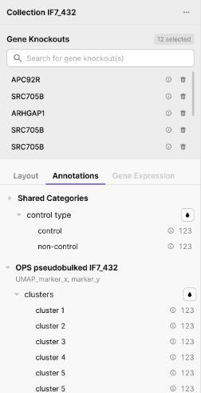
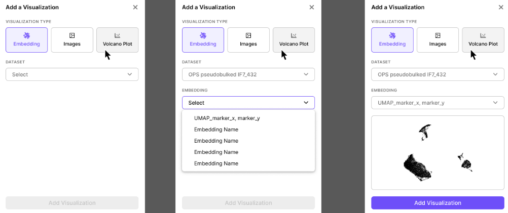
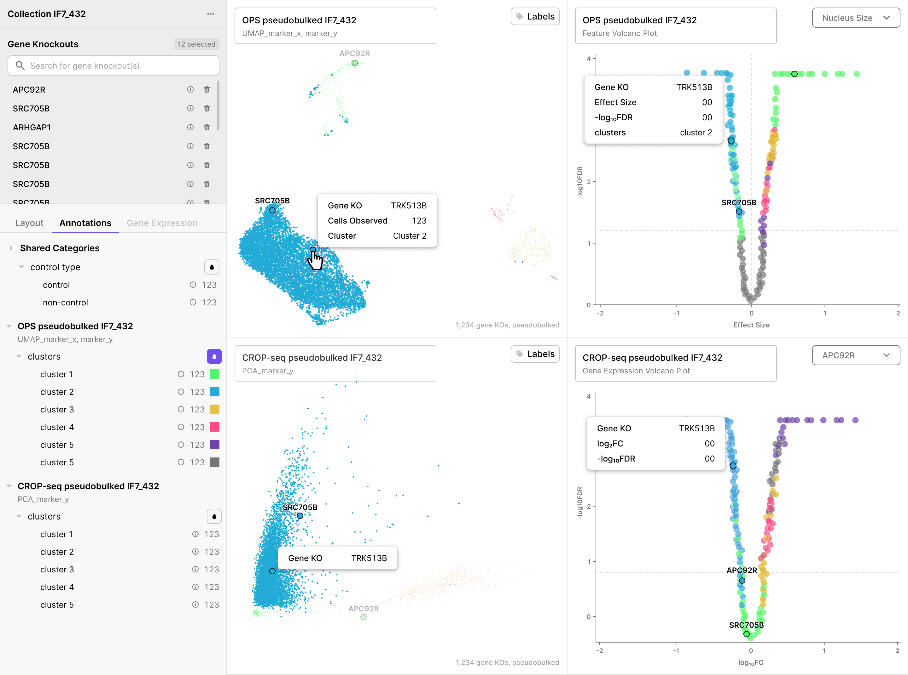

# OPS Explorer Quickstart

  <a href="https://biohub.ai/ops-explorer/about?utm_source=docsite&utm_medium=banner&utm_campaign=ops-jun2026" class="md-button hero-button">
    Use the Explorer
  </a>

A short, visual tour of the viewer for first-time users. For full reference detail, see the [Comprehensive Reference for the OPS Explorer](../reference/index.md).

## Contents

- [Tour of the Viewer](#tour-of-the-viewer)
    - [Left Panel](#left-panel)
    - [Visualization Panels](#visualization-panels)
- [Essential Actions](#essential-actions)
- [Quick Tips & FAQ](#quick-tips-and-faq)

## Tour of the Viewer

From the **OPS Explorer about page**, click **Explore** on any collection to open the viewer full-screen.

The viewer is split into two regions:

  

| Region | What it does |
|---|---|
| **Left Panel** (control center) | Search gene knockouts, manage panels, apply coloring |
| **Visualization Panels** (right side, 1–4 panels) | Show embeddings, fluorescence images, and volcano plots |

Hovering or clicking a dot in any visualization panel highlights the same gene knockout across **every other open panel simultaneously**.

> **Note:** In this viewer, **each dot is one gene knockout - not a cell.** This is different from CellxGene, where each dot is one cell. Hovering on a dot will show how many cells there are for that gene KO. Only the volcano plot generated with CROP-seq data (shown below) is where each dot is a measured gene.

### Left Panel

The left panel has two regions:

  

**Top region - Gene Knockouts**

- **Search bar** - find and add gene knockouts from the collection
- **Selected list** - each row has an **ⓘ** (gene info) and a **delete** button
- **Counter** in the top-right shows how many knockouts are selected

**Bottom region - Layout, Annotations, and Gene Expression**

- **Layout** - add, remove, edit, and rearrange panels
- **Annotations** - color all appropriate panels by a categorical annotation (e.g. cluster)
- **Gene Expression** - color CROP-seq panels by a measured gene's expression level

  

The book (📖) icon in the top-right of the left panel next to the collection name opens a Resources drop down with **Documentation** or **Learn about OPS Explorer**.

  

### Visualization Panels

The right side of the viewer holds 1–4 visualization panes of four possible types:

| Pane type | Each dot is | Used for |
|---|---|---|
| **Embedding** (UMAP-style) | One gene knockout | Cluster overview, perturbation grouping |
| **Images** | (No dots - image grid) | Browsing 3 channel cell crops per knockout x marker combination |
| **OPS Feature Volcano** | One gene knockout | Finding KOs with the largest morphological effect |
| **CROP-seq Gene Expression Volcano** | One **measured transcript** (~20K dots) | Finding differentially expressed genes for a chosen condition |

  

> **Important:** The CROP-seq Gene Expression Volcano is the only panel where dots are **not** gene knockouts. Annotation coloring and selection-from-list do not apply to it.

## Essential Actions

| **Action** | **What to do** |
|---|---|
| Open a collection in the viewer | Click **Explore** on the collection row |
| Select feature for OPS volcano | **Feature selector** dropdown in top right of volcano panel |
| Find a knockout in the embedding | Type the name in the *Search for gene knockout(s)* bar |
| See microscopy images for a KO | With **Images** pane open in the viewer, select a gene knockout and the Images pane will populate automatically |
| Locate a knockout across all open panels | Hover its name in the Gene Knockouts list, or its dot in any panel |
| Color all panels by cluster | **Annotations** tab → click droplet icon button next to *annotation category* |
| Color CROP-seq panels by gene expression | **Gene Expression** tab → add a gene → click its **● color** icon |
| Open an image at full resolution | Click any image → opens the **idetik viewer** in a new tab |
| Add a new panel | **Layout** tab → **+ Add Visualization** |
| Look up gene info | Click **ⓘ** next to a KO name → Gene Info sidebar |
| See all KOs in a cluster | Click **ⓘ** next to an annotation category in the Annotations tab → Cluster Info sidebar |
| View collection metadata | **···** menu → **View collection details** |
| Download a collection | Click **⤓** next to collection name → **Download collection** |

## Quick Tips and FAQ

**Why is each dot a "gene knockout" and not a cell?**
Because the underlying data is aggregated per perturbation: each dot summarizes the average effect across all cells that received that knockout. UMAPs from CellxGene work differently (i.e., one dot = one cell).

**Why doesn't annotation color appear on my CROP-seq Gene Expression Volcano?**
Dots in that panel are measured transcripts, not gene knockouts, so coloring by KO-level annotations doesn't apply. Coloring works on the other three panel types.

**Why is the Gene Expression tab grayed out on my OPS panel?**
Per-gene expression data only exists for CROP-seq datasets. OPS panels show an amber **⚠ Limited** badge when a gene expression overlay is active.

**How do I tell which feature drives the OPS volcano?**
The feature selector dropdown is in the top-right of the volcano panel. The selected feature name also appears on the x-axis label.

**How do I see images larger than the thumbnails?**
Click any image in the Images panel. It opens in the [**idetik viewer**](https://github.com/chanzuckerberg/idetik) in a new browser tab for full-resolution viewing.

**Can I undo a change to my panel layout or knockout selection?**
No, the viewer does not have undo/redo. Re-do the change manually.

**Where are images coming from?**
Each gene knockout shows ~3 representative image crops per imaging marker, chosen by the dataset authors. The CONTROL row at the top is pinned at the top for visual comparison with the KO images. Viewers can access all images by downloading the entire collection.

**How many panels can I open at once?**
Minimum 1, maximum 4. Layout orientation options change based on how many you have open.

## Next Steps

- Read the full tutorial: [Visualizing Data in the OPS Explorer](https://chanzuckerberg.github.io/ops-schema/tutorials/reference/)
- Programmatic access: [CLI Programmatic Data Access](https://chanzuckerberg.github.io/ops-schema/cli/)
- Explore and download datasets: [Data Analysis Notebooks](https://chanzuckerberg.github.io/ops-schema/analysis/)

