# Comprehensive Reference Guide for the OPS Explorer

  <a href="https://biohub.ai/ops-explorer/about?utm_source=docsite&utm_medium=banner&utm_campaign=ops-jun2026" class="md-button hero-button">
    Use the Explorer
  </a>

The OPS Explorer is a full-screen, multi-panel workspace for exploring OPS and CROP-seq datasets together. You can view embeddings, fluorescence image galleries, and volcano plots side by side. Everything is linked, so selecting a gene knockout highlights it across every open panel simultaneously.

A collection may contain both OPS datasets (morphological imaging) and CROP-seq datasets (single-cell transcriptomics). The viewer can display panels from both modalities at once, and each panel type behaves slightly differently depending on the underlying data (see Visualization Panels).

## Contents

- [Opening the Viewer](#opening-the-viewer)
- [Collection Info View](#collection-info-view)
- [Default Layout](#default-layout)
- [The Left Panel](#the-left-panel)
    - [Gene Knockouts](#gene-knockouts)
    - [Gene](#gene)
    - [Cluster](#cluster)
    - [Layout Tab](#layout-tab)
    - [Adding a Visualization Panel](#adding-a-visualization-panel)
    - [Editing or Removing a Panel](#editing-or-removing-a-panel)
- [Visualization Panes](#visualization-panes)
    - [Embedding Panel](#embedding-panel)
    - [Images Visualization Pane](#images-visualization-pane)
    - [OPS Feature Volcano Plot](#ops-feature-volcano-plot)
    - [CROP-seq Gene Expression Volcano Plot](#crop-seq-gene-expression-volcano-plot)
    - [Annotations Tab](#annotations-tab)
    - [Gene Expression Tab](#gene-expression-tab)
- [Interacting with the Viewer](#interacting-with-the-viewer)
    - [Hovering a Dot](#hovering-a-dot)
    - [Cross-Panel Sync](#cross-panel-sync)
- [Quick Reference](#quick-reference)
<!-- - [What the Viewer Does Not Include](#what-the-viewer-does-not-include) -->

## Opening the Viewer

Click **Explore** on one of the collections surfaced on the **OPS Explorer About page** to open 

**Collection options**: three buttons in the top-right of the left panel next to the collection name:

  

- **Collection details ⓘ** - replaces left panel content with a [collection summary](#collection-info-view)
- **Download collection ⤓** - provides code snippet to download the collection via CLI
- **Resources 📖** - opens a dropdown with 2 actions

  

## Collection Info View

Click **ⓘ Collection details** to replace the Gene Knockouts and tab content with a collection-level summary.

The summary includes:

- **← Back** button - returns to the Gene Knockouts view
- Collection title
- **Publication** - linked citation
- **Contact** - linked researcher name
- Description of experimental context
- **Download** button

  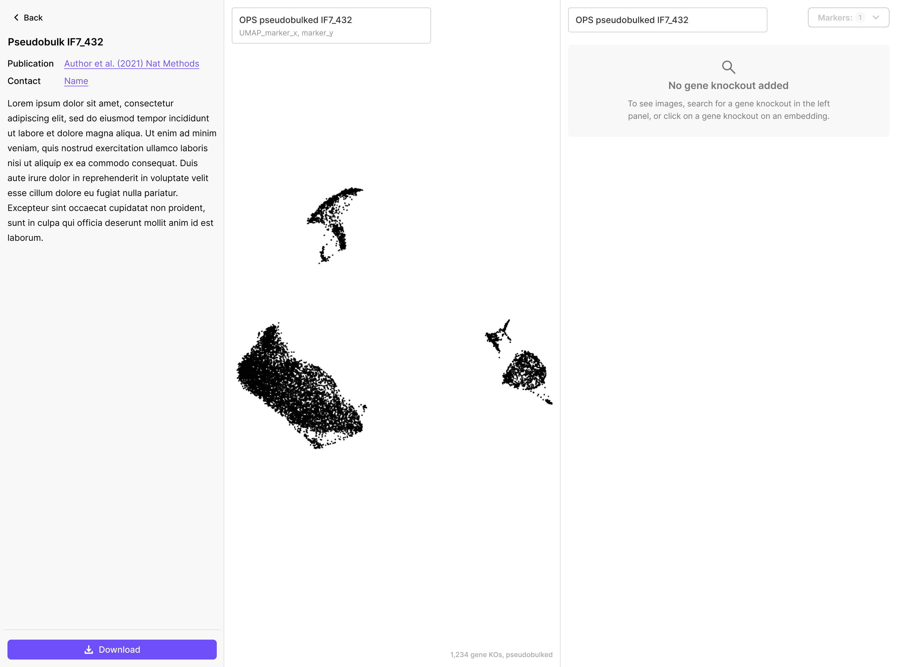

The viewer always shows one **collection** at a time. A collection may contain multiple OPS datasets, multiple CROP-seq datasets, or both. Each open panel shows data from one dataset within that collection.

## Default Layout

What you see on first open depends on which dataset type you launched from:

| **Launched from** | **Default panels** |
|---|---|
| OPS dataset | Embedding (left) + Images (right) - side by side |
| CROP-seq dataset | Embedding only - full width |

The OPS default gives you a ready-made view: as soon as you select a gene knockout, the Images panel populates automatically.

  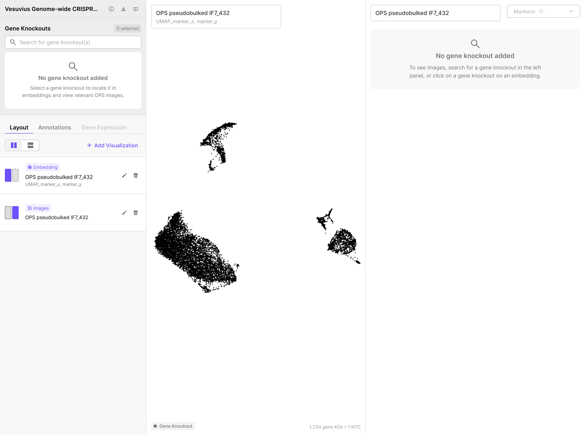

Each panel shows a floating label in its top-left corner with the **dataset name** and, for embeddings, the **embedding name** (e.g. *UMAP_marker_x, marker_y*). The Images panel shows only the dataset name.

You can change this layout at any time using the [Layout Tab](#layout-tab).

## The Left Panel

The left panel is the control center for the entire viewer. It is divided into two regions:

- **Gene Knockouts** (top half) - search and select knockouts to highlight across all panels
- **Three tabs** (bottom half) - [Layout](#layout-tab), [Annotations](#annotations-tab), [Gene Expression](#gene-expression-tab)

### Gene Knockouts

The Gene Knockouts (KO) section is the primary control. Selecting a knockout there highlights it in every open visualization simultaneously. The embedding, the images panel, and the volcano plot all update together.

**To add a gene knockout:**

1. Click the **Search for gene knockout(s)** bar and search for your gene knockout of interest.
2. A dropdown lists all knockouts available in the collection. Checked items are already selected.
3. Click a name to add it, or uncheck to remove it.
4. If your search term has no results, *No matches found* appears.

  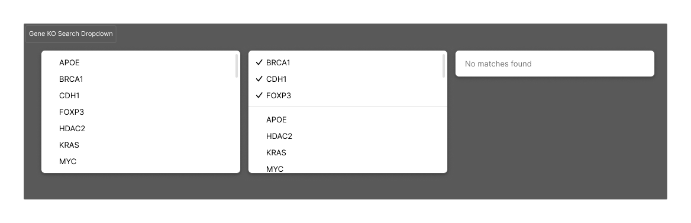

Once added, each knockout appears as a row with:

- The gene name
- An **ⓘ** button - opens the [Gene Info](#gene) sidebar
- A **delete** button - removes it from the selection

A counter in the top-right shows how many are active.

  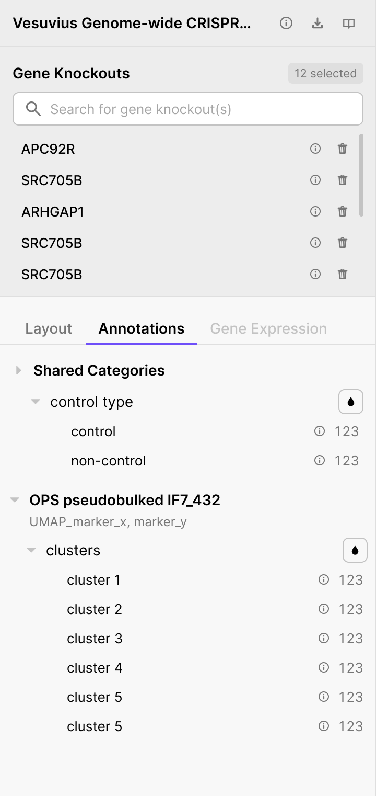

**Hovering a name in the list** highlights that knockout's dot across all open panels and fades all other dots into the background.

  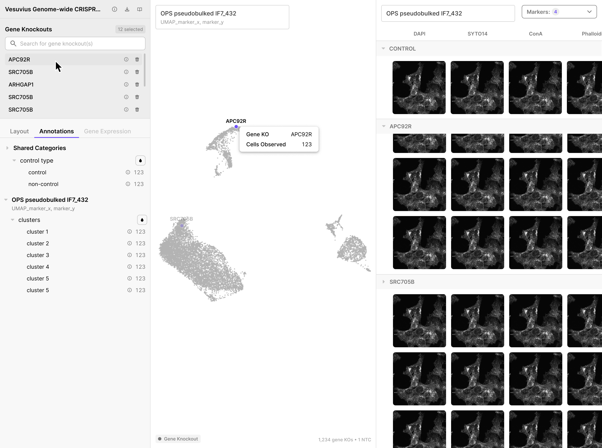

### Gene

After clicking ⓘ next to a gene knockout:

The sidebar shows:

- Gene name and description
- External database links: **Gene Pathways ↗** and **Protein Complexes ↗**
- A **Knockout Effects** table with physical and transcriptional effect summaries for this gene in the current dataset

  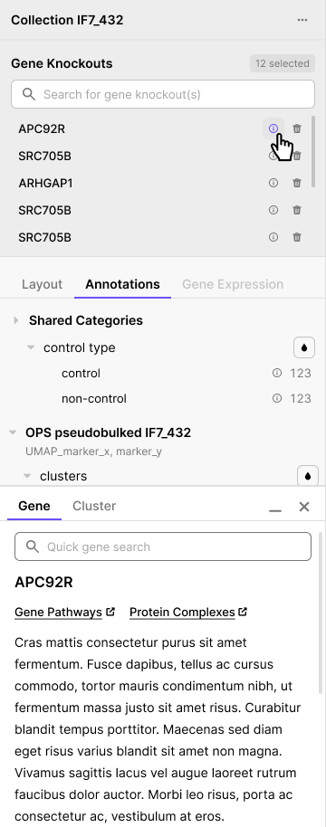

Click **−** to minimize the sidebar or **×** to close it.

### Cluster

Clicking an **ⓘ** button next to a cluster in the [Annotations Tab](#annotations-tab) opens a cluster info sidebar.

After clicking ⓘ next to a cluster in the Annotations tab:

The sidebar shows a breadcrumb identifying the dataset, embedding, and cluster, followed by a table listing all gene knockouts assigned to that cluster.

  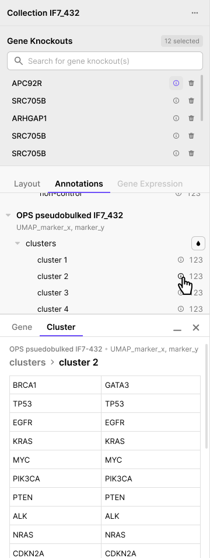

### Layout Tab

The Layout tab controls which panels are open and how they are arranged. It is the default tab when you first open the viewer.

  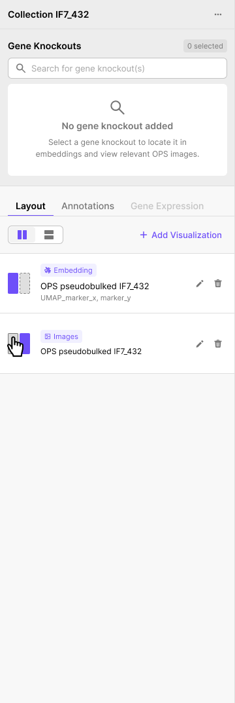

**Visualization list** - each row represents one open panel and shows:

- A **thumbnail** indicating the panel's position in the layout
- A **chip** label: **Embedding**, **Images**, or **Volcano Plot**
- The dataset name as a subtitle
- **Edit** and **Delete** buttons on hover

  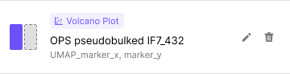

**+ Add Visualization** - opens the Add Visualization sidebar. The viewer supports a minimum of **1** and a maximum of **4** panels open at once. See [Adding a Visualization Panel](#adding-a-visualization-panel).

### Adding a Visualization Panel

Click **+ Add Visualization** in the [Layout Tab](#layout-tab). A sidebar slides open on the left.

**Step 1 - Choose a visualization type:**

  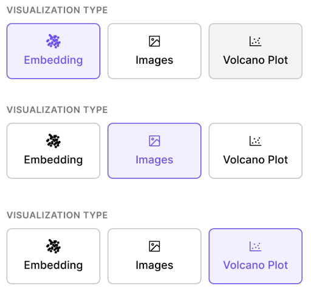

**Step 2 - Select a dataset** from the dropdown.

**Step 3 - Select an embedding** (Embedding and Volcano Plot types only). Multiple embeddings may be available per dataset. For the Embedding type, a **live preview** appears in the sidebar before you confirm.

  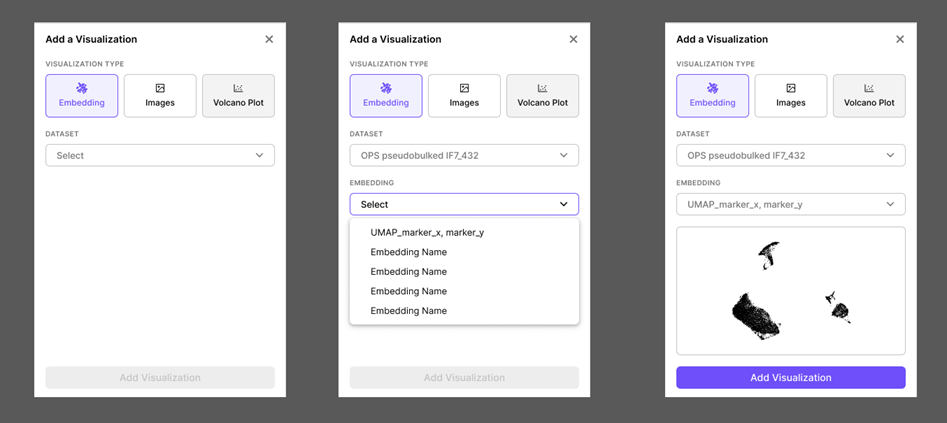

> **Images panes** are available for OPS datasets only. No embedding selection is needed. Just choose the dataset and click Add.

Once all required fields are complete, click **Add Visualization**. The sidebar closes and the new pane appears in the layout.

<!-- 

  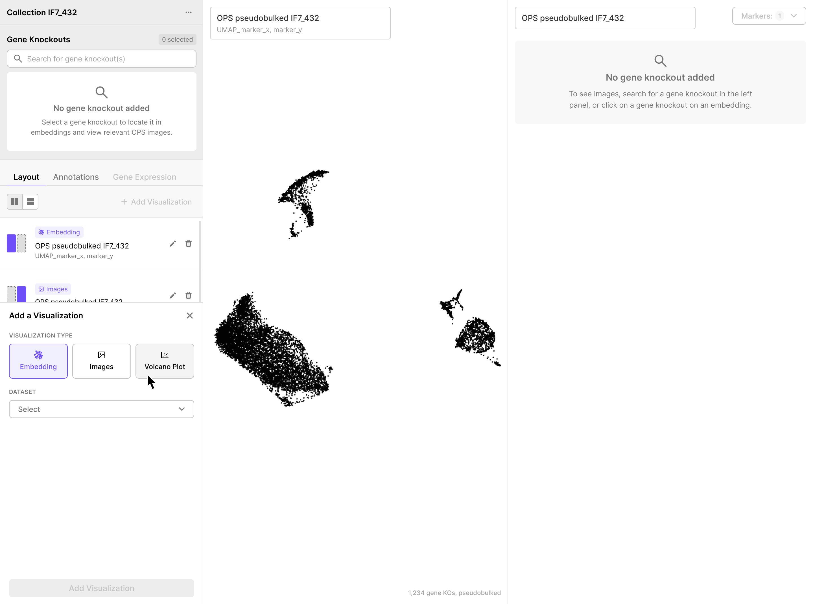

 -->

### Editing or Removing a Panel

In the [Layout Tab](#layout-tab), each row has the following action buttons:

- **Edit** (✏️ icon) - opens the same Add Visualization sidebar pre-filled with the current settings. The confirm button reads **Apply Changes**.
- **Delete** (🗑️ icon) - removes the panel immediately.

  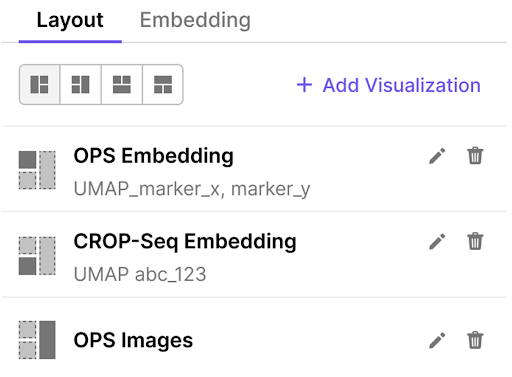

## Visualization Panes

The right side of the viewer shows one to four panels. This section covers what each panel type displays and how to interact with it. For hover and click interactions shared by all panels, see [Interacting with the Viewer](#interacting-with-the-viewer).

### Embedding Panel

The Embedding panel shows a scatter plot where **each dot is one gene knockout**, positioned according to the dataset authors' chosen embedding. For OPS datasets, positions typically come from morphological imaging features (e.g. computed with CellProfiler or a deep learning model; e.g. nucleus size). For CROP-seq datasets, positions come from transcriptomic profiles.

<!-- 

  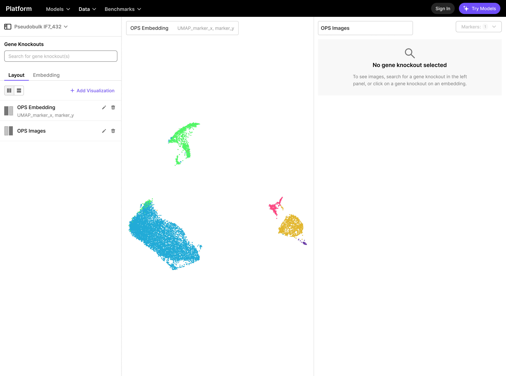

 -->

  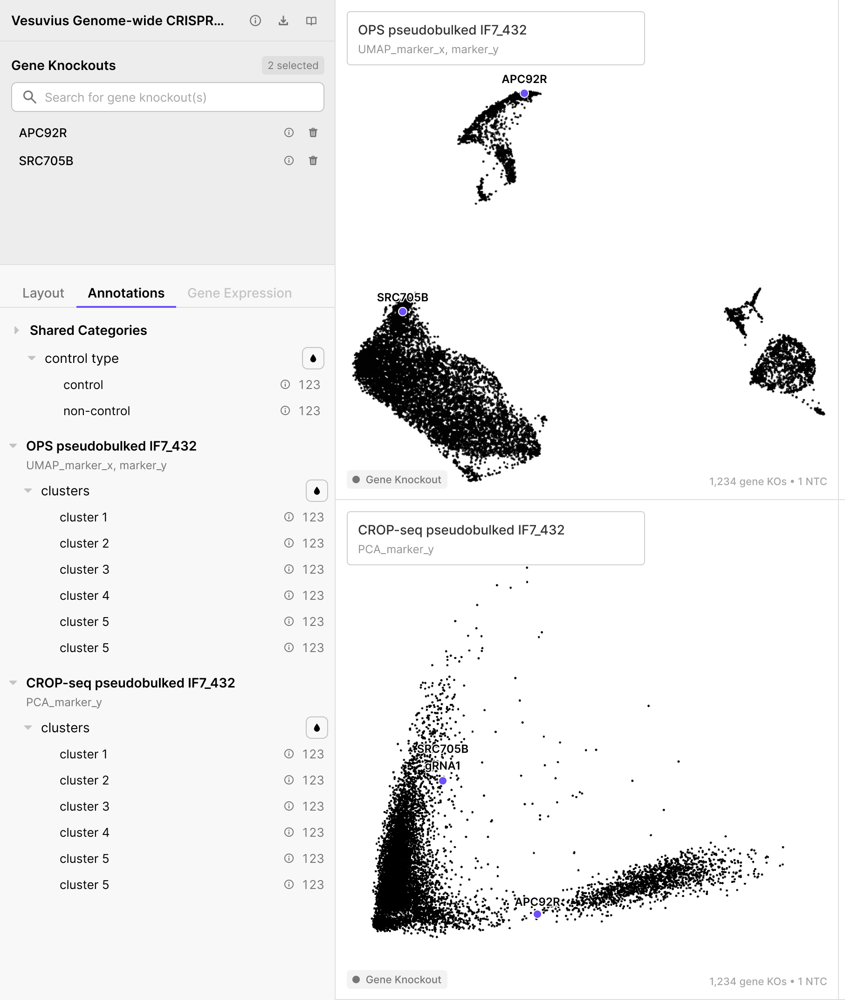

<!-- 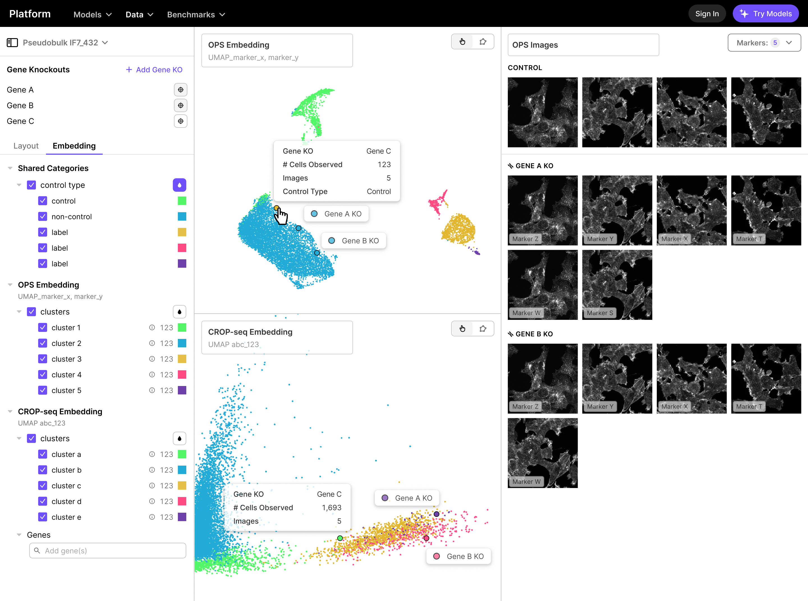 -->

When gene knockouts are selected from the [Gene Knockouts](#gene-knockouts) section, they appear as labeled, highlighted dots on the plot. See [Hovering a Dot](#hovering-a-dot) and [Clicking a Dot](#clicking-a-dot) for interaction details.

### Images Visualization Pane

The Images pane shows representative fluorescence image crops for each selected gene knockout, organized as a grid of rows (one per knockout) and columns (one per imaging marker; e.g., DAPI, ConA, Phalloidin).

When gene knockouts are selected:

  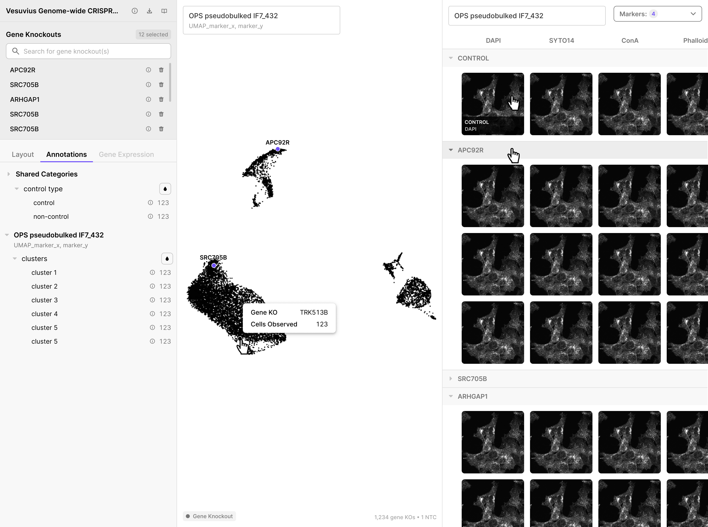

**Grid structure:**

- **Column headers** - each column is one fluorescent marker, a stain highlighting a specific cellular structure (e.g. DAPI for DNA, ConA for cell membranes, phalloidin for actin)

- **CONTROL row** - always **pinned at the top**: it stays fixed as you scroll down, so you always have control images as a visual reference
- **Gene KO rows** - one row per selected knockout, with approximately **3 representative image crops per marker**
- Each row can be **collapsed or expanded** with the arrow on its header

**Controls:**

- **Markers: N ▾** dropdown (top-right) - select how many markers to show as columns. Up to **20 markers** can be displayed at once. Scroll horizontally to see all columns.
- **Hovering an individual image** shows information confirming the gene KO name and marker
- **Clicking an image** opens it in the [**idetik viewer**](https://github.com/chanzuckerberg/idetik) in a new browser tab for full-resolution viewing

**Image display modes**

The images pane shows image crops of selected gene knockouts:

  

### OPS Feature Volcano Plot

The OPS Feature Volcano Plot shows the morphological effect of every gene knockout in the screen for a chosen cellular feature. This is useful for identifying which perturbations have the strongest or most statistically significant effects.

**What the dots represent:**

- Each dot = one gene knockout (same as the [Embedding Panel](#embedding-panel))
- Selected gene knockouts are labeled on the plot
- Dots can be colored by [Annotations](#annotations-tab)

**Axes:**

- **X-axis: Effect Size** - magnitude of morphological change vs. non-targeting control for the selected feature
- **Y-axis: −log₁₀FDR** - false discovery rate corrected p-value as a measure of [statistical significance](https://en.wikipedia.org/wiki/False_discovery_rate)

**Feature selector**

- **top-right dropdown** - choose which morphological feature drives the x-axis (e.g. *Nucleus Size*, *Nucleus Area*, *Mitochondria Intensity*). The selected feature name also appears on the x-axis label.

For hover and click interactions, see [Interacting with the Viewer](#interacting-with-the-viewer).

  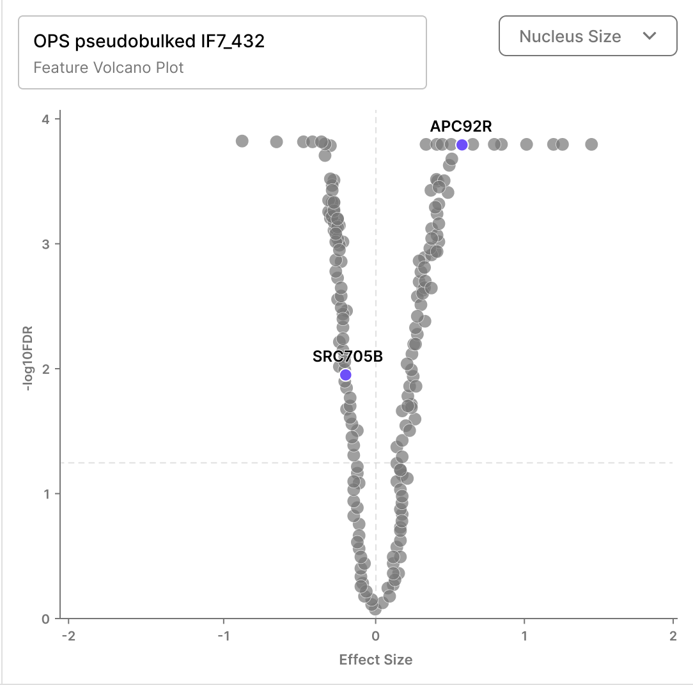

### CROP-seq Gene Expression Volcano Plot

The CROP-seq Gene Expression Volcano Plot shows which transcripts are differentially expressed for a chosen gene condition.

> **Note:** Each dot here is a **measured transcript (gene)**, not a gene knockout. There are approximately 20,000 dots, one per transcript in the CROP-seq dataset.

**Comparison with the OPS Feature Volcano:**

| | **OPS Feature Volcano** | **CROP-seq Gene Expression Volcano** |
|---|---|---|
| Each dot is | A gene knockout | A measured transcript |
| Dot count | ~1,000–5,000 | ~20,000 |
| Selected KOs labeled? | Yes | No - dots are different entities |
| Colored by annotation? | Yes | No |
| Selector changes | Morphological feature | Measured gene |
| X-axis | Effect Size | Log₂ Fold Change |
| Y-axis | −log₁₀FDR | −log₁₀(p-value) |

**Gene selector** (top-right dropdown): choose which **measured gene** to use to display a volcano plot. The plot then shows how the expression of all ~20,000 transcripts changes when that gene is knocked out.

  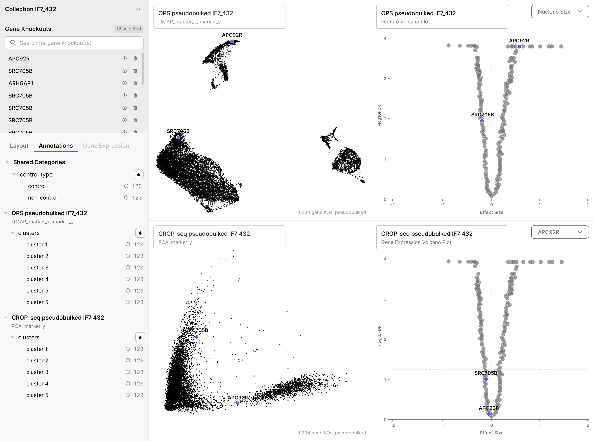

### Annotations Tab

The Annotations tab lets you color all eligible panels by a biological annotation, making it easy to see how gene knockouts group by cluster or control status. All annotations are supplied by the dataset authors.

  

**Shared Categories** apply across all datasets in the collection:

- **control type** - *control* and *non-control*, each with a cell count

**Per-dataset sections** appear below (e.g. *OPS pseudobulked IF7_432 / UMAP_marker_x, marker_y*):

- **clusters** - cluster 1 through cluster 5+, each with a count and an **ⓘ** button that opens [Cluster](#cluster)

**To apply a color:** click the filled dot (**⬤**) button next to any category or *clusters* label. All eligible panels update immediately.

**Which panels get colored:**

| **Panel type** | **Gets annotation color?** |
|---|---|
| OPS Embedding | Yes |
| CROP-seq Embedding | Yes |
| OPS Feature Volcano Plot | Yes |
| CROP-seq Gene Expression Volcano Plot | **No** - dots are measured genes, not knockouts |

<!-- **Without annotation color:**

  

 -->

**With annotation color and hover active:**

Hovering a dot highlights its cluster and fades all other clusters across all linked panels simultaneously.

  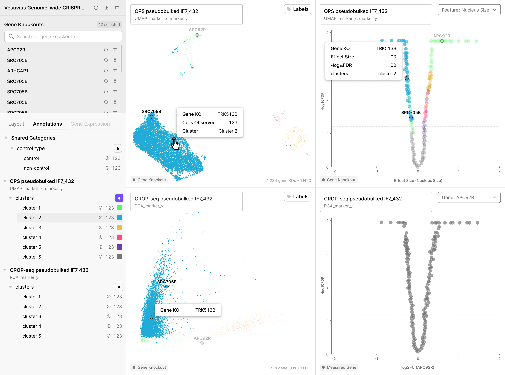

**With labels on:**

  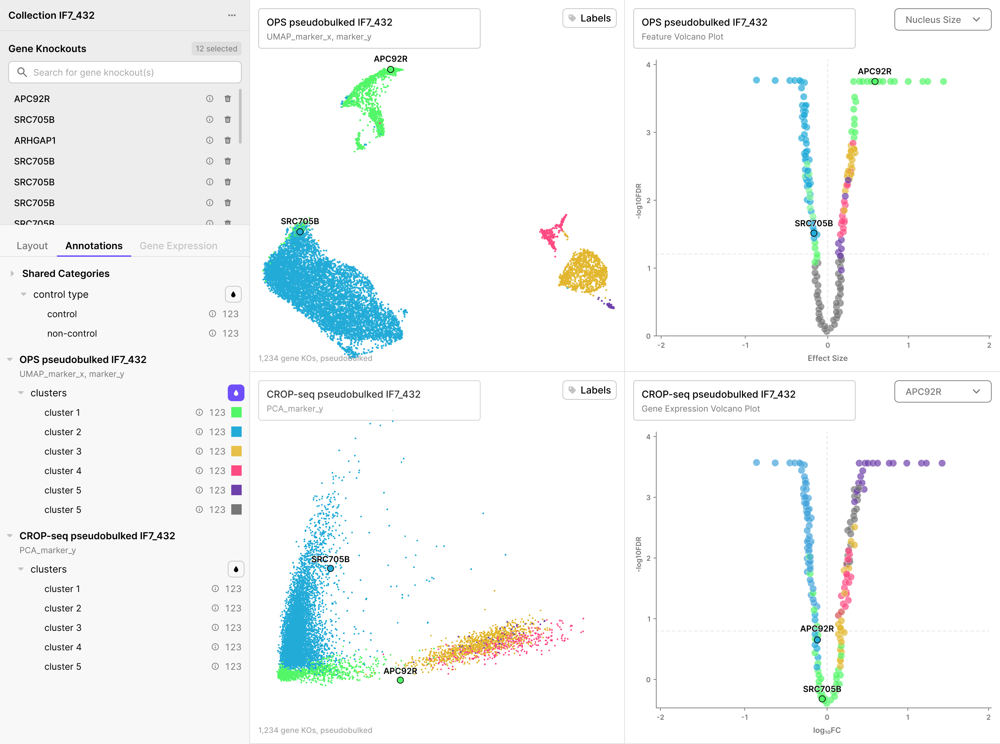

### Gene Expression Tab

The Gene Expression tab lets you color panels by the expression level of a specific measured gene. This coloring applies **only to CROP-seq panels**.

  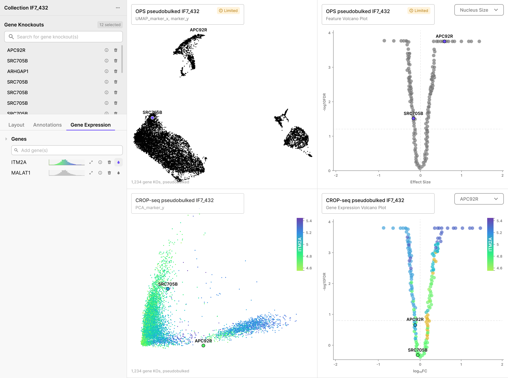

**To add a gene expression overlay:**

1. Click **Add gene(s)** and type a gene symbol.
2. The gene appears as a row with a miniature expression histogram.
3. Click the **⬤ color** icon on that row to activate it as the color overlay.

CROP-seq embeddings are colored with a **continuous (gradient) color scale** based on expression level.

OPS panels show an amber **⚠ Limited** badge. Hovering the badge shows:

  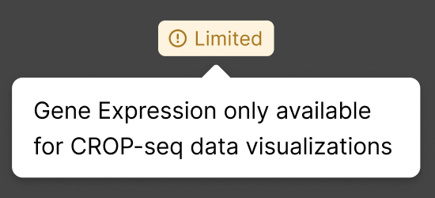

<!-- 

  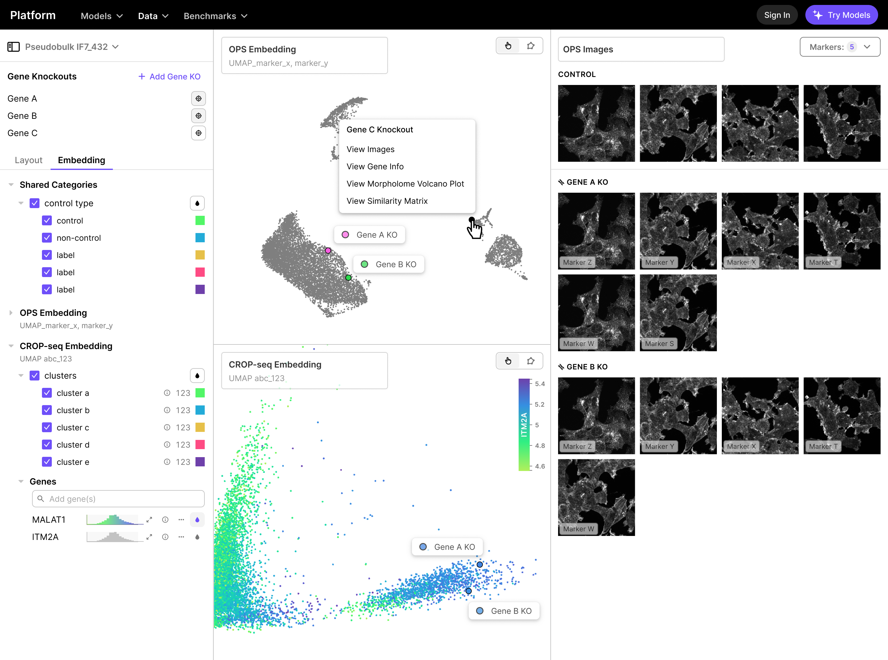

 -->

Switching back to the [Annotations Tab](#annotations-tab) restores annotation-based coloring across all eligible panels. If more than 20 gene knockouts are selected there will be a pop-up notification **Gene knockout limit reached**.

  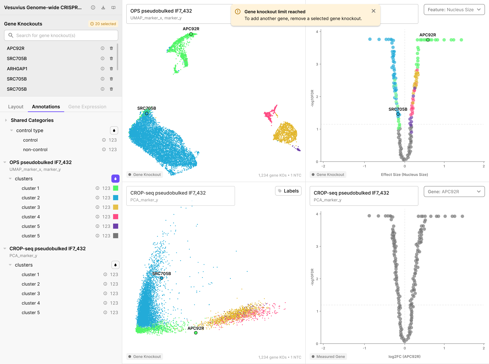

## Interacting with the Viewer

This section covers hover, click, and cross-panel behaviors that apply across all panel types.

### Hovering a Dot

Hovering any dot in an embedding or volcano panel shows a tooltip. The fields shown depend on the panel type:

**OPS or CROP-seq Embedding, OPS Feature Volcano:**

| **Field** | **Description** |
|---|---|
| Gene KO | Name of the gene knockout |
| Cluster | Cluster assignment |
| # Cells Observed | Number of cells that received this perturbation |
| Images | Number of representative images available (embeddings only) |

<!-- 

  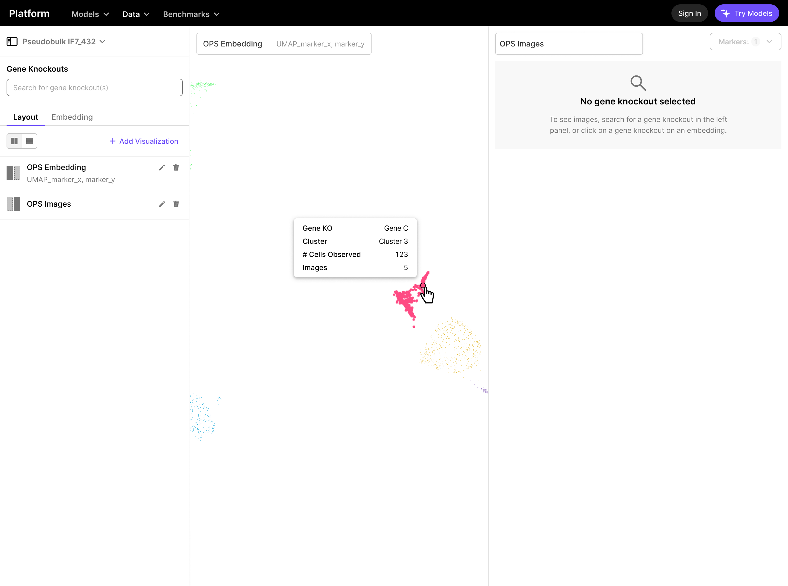

 -->

**When annotation color is active**: hovering also fades all dots not in the same cluster, isolating the hovered cluster across all eligible linked panels at the same time.

**CROP-seq Gene Expression Volcano**: tooltip shows the transcript name, log₂FC (fold change), and −log₁₀FDR (false discovery rate = corrected p-value).

  

<!-- 

  

 -->

**Hovering a name in the gene list**: highlights that knockout's dot across all open panels and fades all other dots into the background.

  

<!-- ### Clicking a Dot

Clicking any dot in an embedding panel opens a context menu with the following actions:

- **Select Gene KO** - adds it to the [Gene Knockouts](#gene-knockouts) selection
- **View Gene Info** - opens the [Gene Info](#gene) sidebar
- **View Images** - jumps to the [Images Panel](#images-panel) for this KO
- **View Feature Volcano Plot** - navigates to the [OPS Feature Volcano Plot](#ops-feature-volcano-plot)
- **View Cluster #** - opens the [Cluster Info](#cluster) sidebar for that cluster

  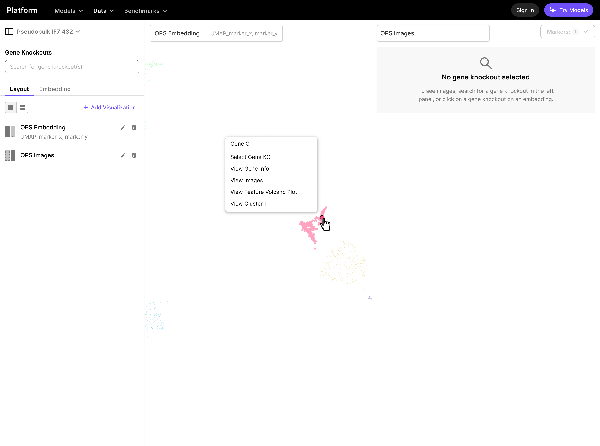

 -->

### Cross-Panel Sync

When you hover a dot in any embedding or volcano panel, the **same gene knockout is simultaneously highlighted in all other open panels**. This lets you compare how the same perturbation appears across the OPS embedding, CROP-seq embedding, OPS volcano, and images without navigating away.

  

<!-- 

  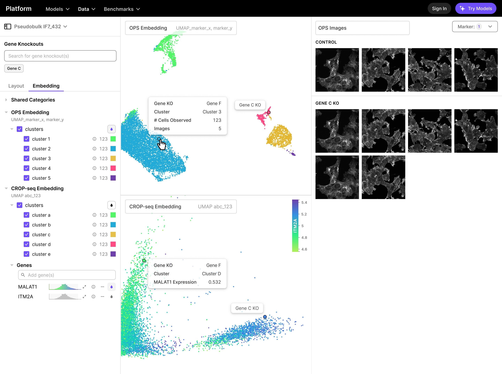

 -->

**Orientation switcher** - Icons at the top change the panel arrangement depending on how many visualization panes are open:

  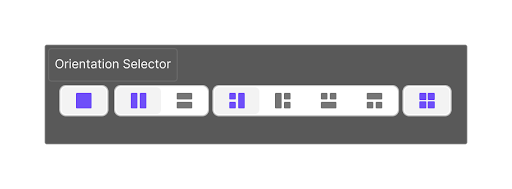

| **Number of open panels** | **Orientation options** |
|---|---|
| 1 | Fixed - no choice |
| 2 | Side by side or stacked |
| 3 | 4 arrangement options |
| 4 | Fixed 2×2 grid - no choice |

## Quick Reference

| **Action** | **What to do** |
|---|---|
| Find a gene knockout in the embedding | Type the name in the [Gene Knockouts](#gene-knockouts) search bar |
| Select feature for OPS volcano | **Feature selector** dropdown in top right of volcano panel |
| See microscopy images for a knockout | With **Images** pane open in the viewer, select a gene knockout and the Images pane will populate automatically |
| Open an image at full resolution | Click any image in the Images Pane - opens in the [idetik viewer](https://github.com/chanzuckerberg/idetik) |
| Identify knockouts with the largest morphological effect | Look at the top edges of the [OPS Feature Volcano Plot](#ops-feature-volcano-plot) |
| Change which feature the volcano shows | Use the Feature selector dropdown in the volcano panel header |
| See which transcripts change for a knockout condition | Open a [CROP-seq Gene Expression Volcano](#crop-seq-gene-expression-volcano-plot); use the Gene selector |
| Color all panels by cluster | [Annotations Tab](#annotations-tab) → click droplet icon (**⬤**) next to *clusters* |
| See which knockouts share a cluster | Hover any dot while annotation color is active - other clusters fade |
| Locate a knockout across all open panels | Hover its dot in one panel - all other panels highlight it simultaneously |
| See all knockouts in a cluster | Click **ⓘ** next to an annotation category in the **Annotations** tab → Cluster Info sidebar |
| Look up external gene info | Click **ⓘ** next to a name in the Gene Knockouts list → [Gene](#gene) |
| Add a new panel | [Layout Tab](#layout-tab) → + Add Visualization |
| Swap two panels' positions | Click the other rectangle in a panel's thumbnail in the Layout Tab |
| Download the collection | Click **⤓** next to collection name → **Download collection** |
| View collection publication and metadata | **···** menu → [View collection details](#collection-info-view) |
